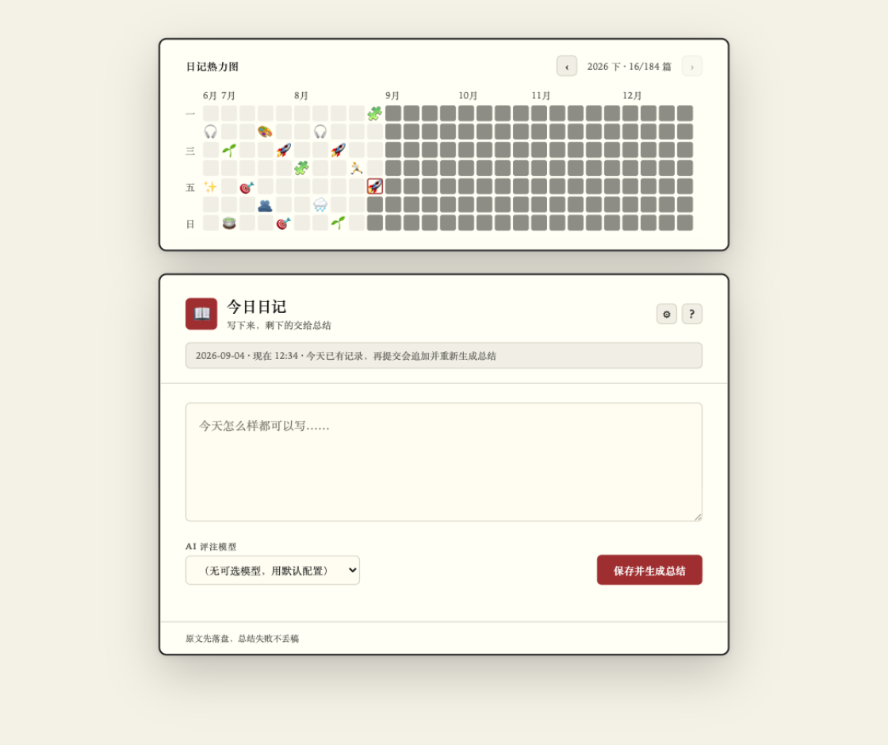
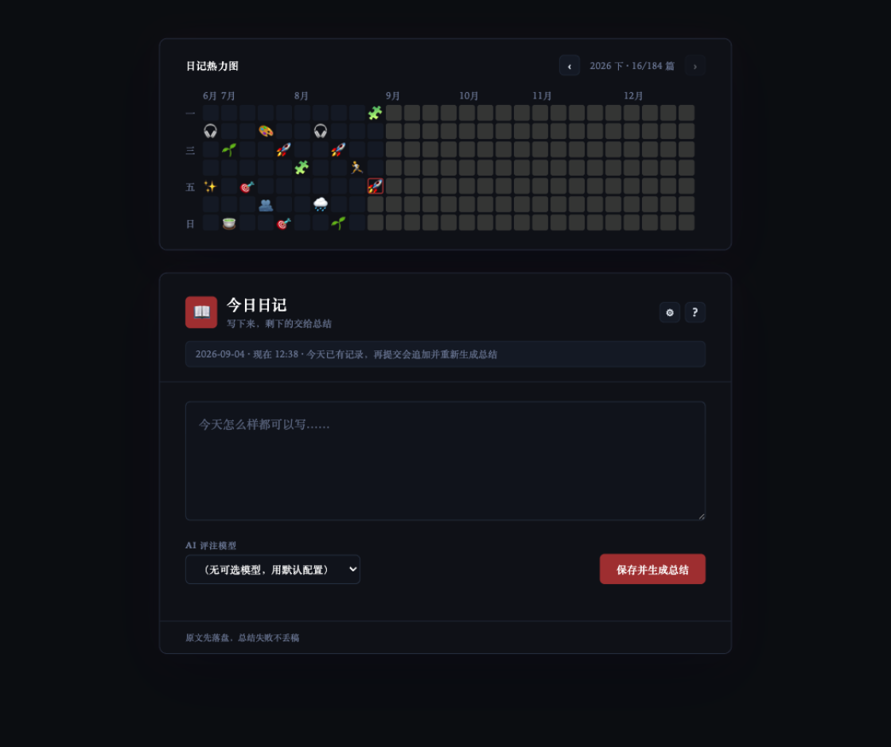
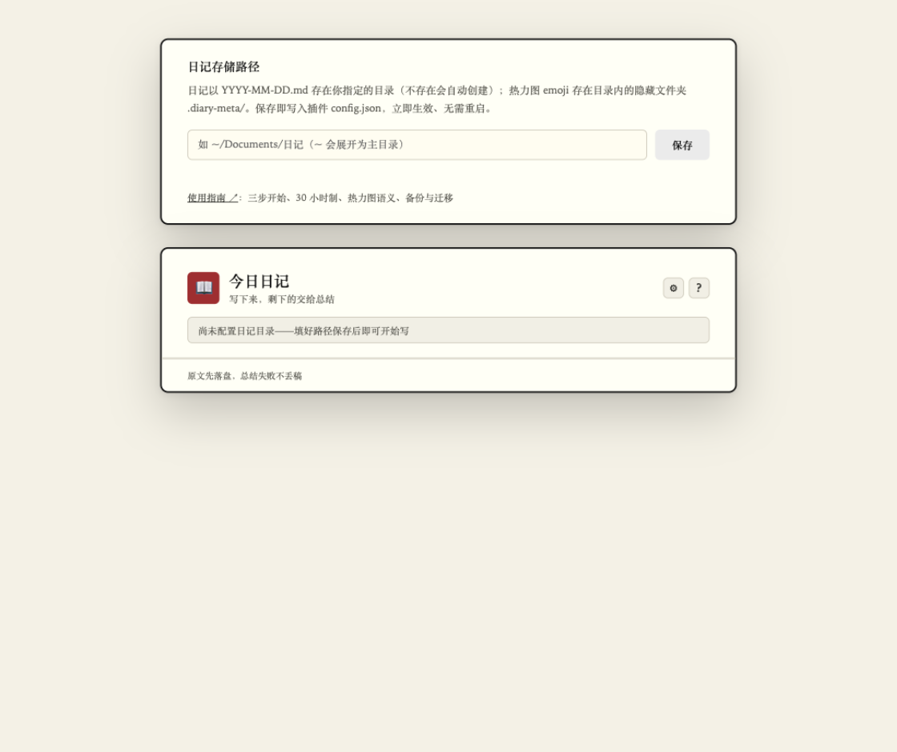
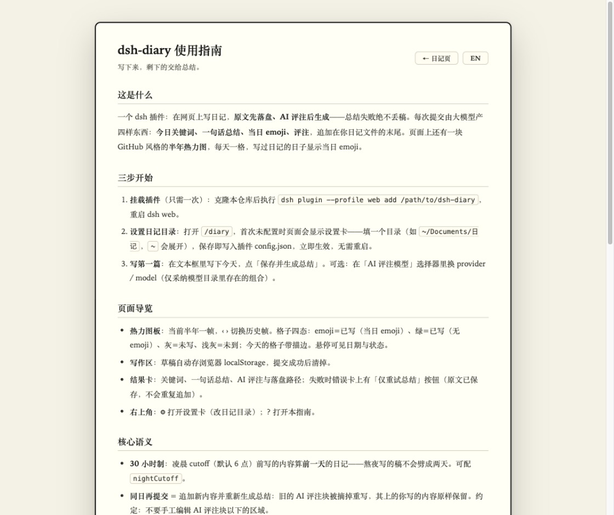

# dsh-diary · 日记插件

dsh（DeepSeek Harness）的日记插件：在一个纸感信纸风的 web 页里写日记，**原文先落盘、AI 评注后生成**——总结失败永远不会丢你的字。

[English](./README.en.md) · 使用指南（装好后页面右上角 `?`，或 `/diary/guide`）

## 界面预览

| 日常写作（亮色） | 暗色 |
|:---:|:---:|
|  |  |

| 首次使用·设置卡 | 内置使用指南（中/EN） |
|:---:|:---:|
|  |  |

## 分工

| 谁 | 负责 |
|---|---|
| 插件代码（确定性） | 30 小时制日期判断（读系统时间）、按模板建档、条目追加、评注区排版、时间戳收尾、再提交时旧评注摘除 |
| LLM（经 `ctx.llm` 直调） | 只产四样东西：【今日关键词】【一句话总结】【当日 emoji】【评注】——provider/model/temperature 默认取插件配置；页面「AI 评注模型」选择器可逐次覆盖 provider/model（仅采纳模型目录里存在的组合，其余静默回退默认） |

## 快速上手

```bash
git clone https://github.com/zhm20001/dsh-diary.git
cd dsh-diary
pnpm install            # lib/ 产物随仓库提交，无需 build
dsh plugin --profile web add <本目录路径>
# 重启 dsh web，浏览器打开 http://127.0.0.1:<port>/diary
```

首次打开页面是**设置卡**：填一个日记目录（如 `~/Documents/日记`，`~` 会展开），保存即写入插件根 `config.json`，立即生效、无需重启。然后写第一篇 → 点「保存并生成总结」。

日常流程：打开页面 → 写 → 提交。原文即刻落盘；总结失败不丢原文，点「仅重试总结」补生成。草稿自动存浏览器 localStorage（按日期分键）。dsh web 侧栏底部也有「日记」入口（`src/client.js`，文案中英自适应）。

## 配置

三层优先级（高 → 低）：

| 层 | 说明 |
|---|---|
| cordis patch / profile config | 装载时注入，最高优先；此处设了 `diaryDir` 时页面设置卡会提示「被覆盖」 |
| 插件根 `config.json` | 页面设置卡维护的就是它；手工编辑也行，`diaryDir` 逐请求现读、改完即生效。字段见 [`config.example.json`](./config.example.json)，相对路径按插件根解析、支持 `~/` |
| 内置默认 | 模板兜底 `assets/diary-template.md`；无目录则进入设置卡模式 |

其余插件项（cordis patch 层）：`provider` / `model`（总结模型，默认 `deepseek-official` / `deepseek-chat`）、`temperature`（0.6）、`timeoutMs`（120000）、`nightCutoff`（6）、`pagePath`（`/diary`；改动需同步 `src/client.js` 里的 href）。

## 隐私与数据

- 日记全文只落本地盘；**唯一的外发**是总结请求：当日全文发给你配置（或页面选择）的 LLM provider，换取四件套。热力图数据、meta、草稿都不出本机（草稿在浏览器 localStorage）。
- 数据自包含在日记目录：正文 `YYYY-MM-DD.md`，当日 emoji 在同目录隐藏文件夹 `.diary-meta/YYYY.json`。**备份 = 整个目录复制**（迁移别漏 `.diary-meta/`，否则 emoji 静默降级成绿块）。
- 「有没有写」永远由目录文件名当场派生（含 `-后缀` 文件），不落缓存：手建/手删/改名即时反映到热力图；meta 里的孤儿 emoji 会被无害忽略。

## 语义细节

- **30 小时制**：凌晨 0 点到 `nightCutoff`（默认 6）之间写的算前一天，收尾时间显示 25:xx–29:xx——深夜补记不会劈成两个文件。
- **同日再提交** = 追加新条目并重新生成整天总结（旧评注块被摘除重写，其上的用户内容永远不动）。约定：不要手工编辑「## AI评注」之下的区域。
- **文件契约**：`<diaryDir>/YYYY-MM-DD.md`，front matter 来自模板（支持空 `date:` 字段或 `{{date}}` 占位）；同日 `2026-04-28-note.md` 这类后缀文件也计入 4-28，同日多文件不重复计数。
- **总结失败**时接口返回 `stage:'summary'` + hint（HTTP 502）；保存失败返回 `stage:'save'`。
- **热力图板**：半年一帧（上=1–6月，下=7–12月），固定 27 周 × 7 格、周一起始，帧窗口从半年首日所在/之前的周一开始，相邻帧共享边缘周（冗余明确允许）。已写=当日 emoji（无则绿块）、已过未写=淡底、未到=灰、今日加描边；分母为该半年实际天数。极少数年份（7月1日逢周日，如 2018/2029）H2 窗口 190 天超出 27 周，12-31 那格不显示（计数不受影响）。
- 往期日记补评注 / 换目录迁移 / 删除某天：见页面内置指南「你的数据」一节。

## 本地开发

```bash
pnpm install
pnpm typecheck
pnpm test               # vitest：core 纯函数 + 路径解析 + 原子写
pnpm build              # 重新生成 lib/（CI 会校验产物与 src 无漂移）

# 冒烟：dev overlay 把插件指向 /tmp/diary-sandbox，不污染真实日记
dsh web --patch dev.patch.yml   # 浏览器访问 /diary-dev
```

结构：`src/core.ts` 纯函数（无 IO）→ `src/paths.ts` 路径变量（config.json 读写）→ `src/service.ts` 路由与编排（webServer/httpServer 双名兼容）→ `src/summary.ts` LLM 管线 → `src/page.ts` 页面 + `src/guide.ts` 指南。`lib/` 为编译产物、随仓库提交（克隆分发免构建）；`src/` 改动必须带 `lib/` 一起提交。

宿主要求：dsh web 宿主（内部 harness 版暴露 `ctx.webServer`，npm `@deepseek-ai/dsh-host-webserver` rc 线暴露 `ctx.httpServer`——两者均兼容）。

## License

[MIT](./LICENSE)
